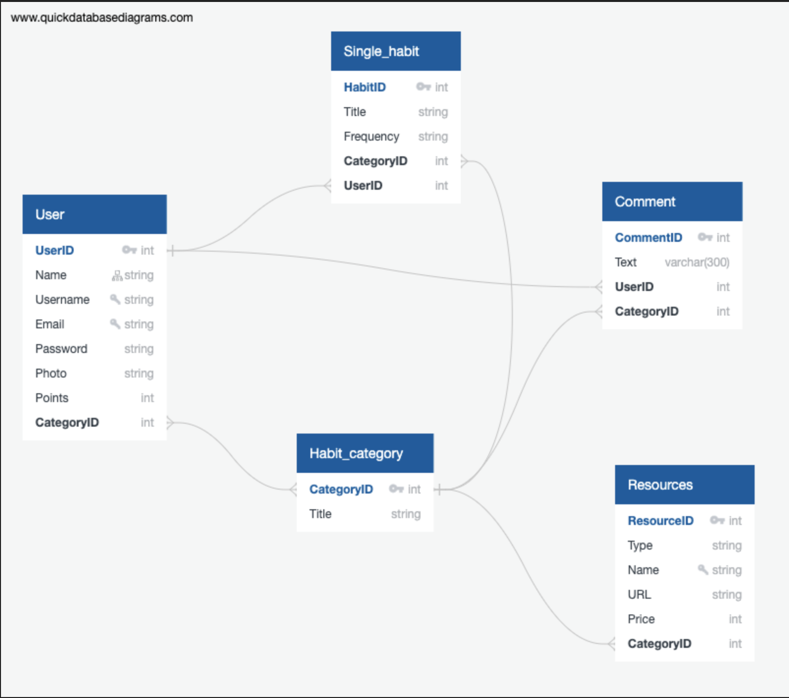
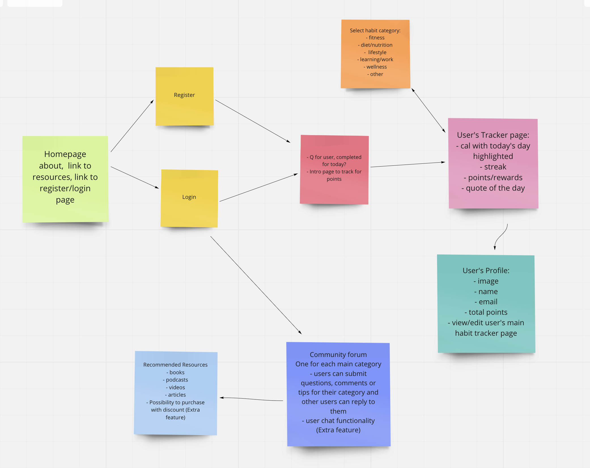
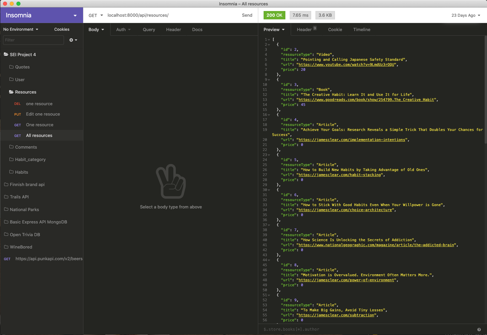
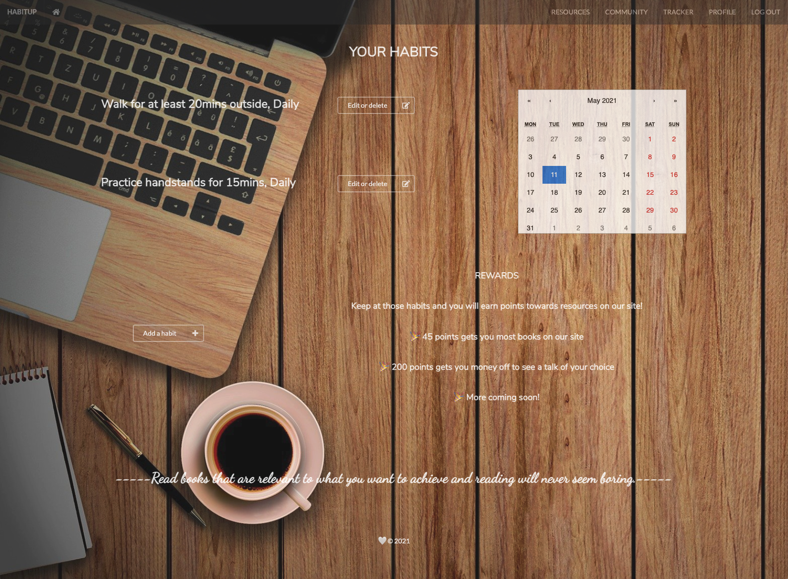
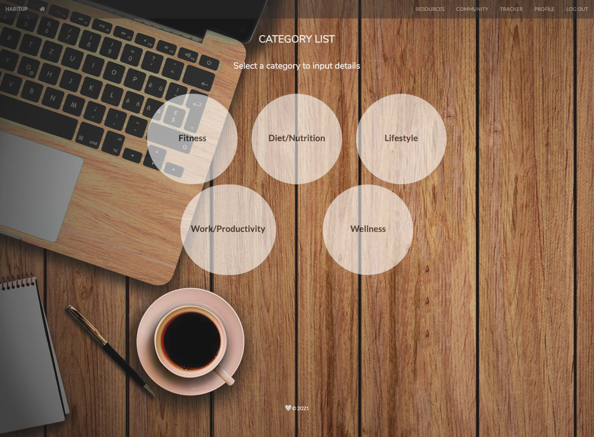
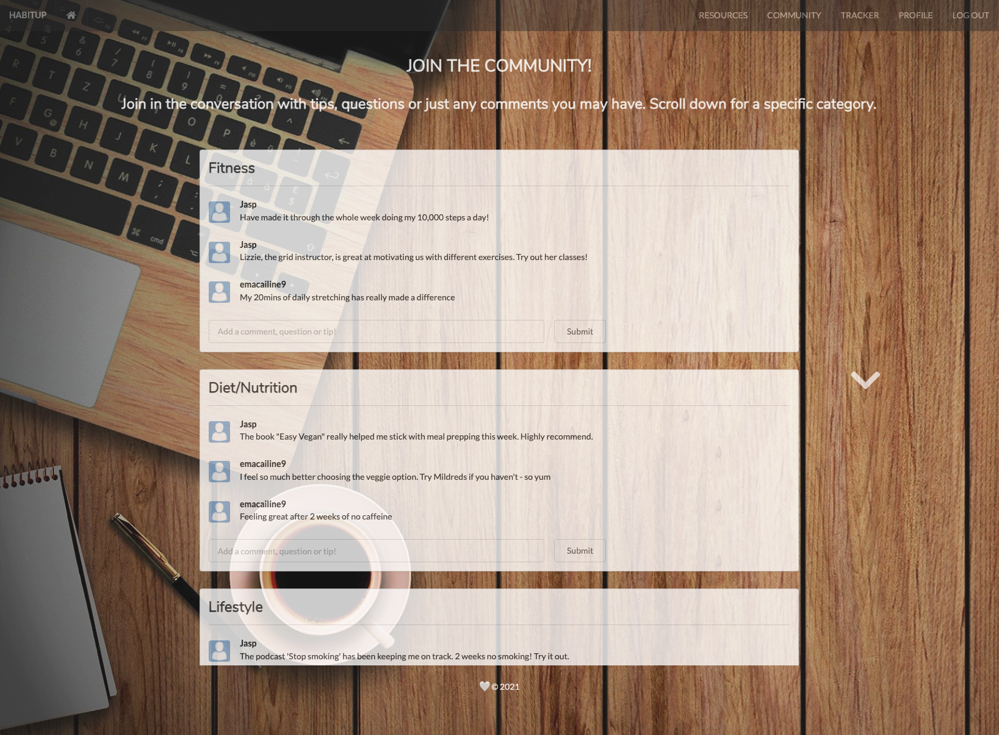
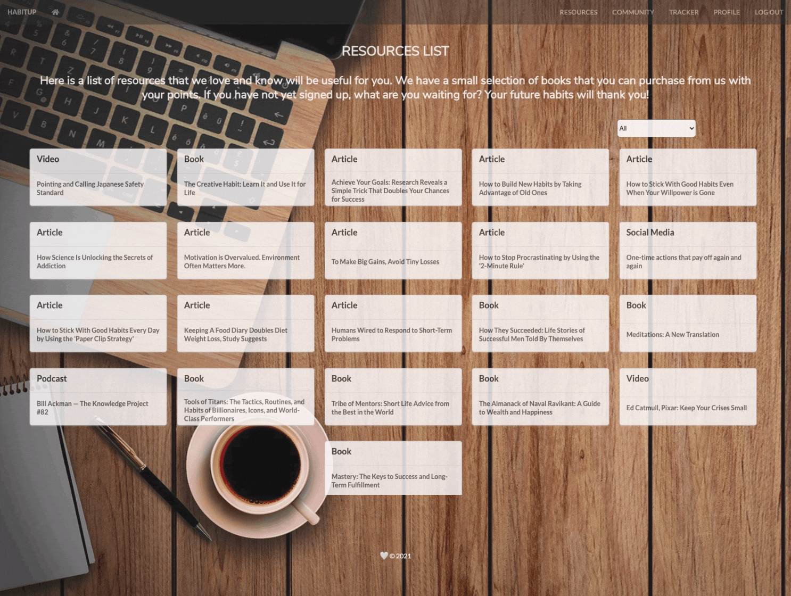

# SEI Project 4: HABITUP

## Table of Contents
Overview<br/>
[Brief & Timeframe](#brief) <br/>
[Link to Project](#project) <br/>
[Technologies used](#technologies-used) <br/>
[Development (screenshots & featured code)](#development) <br/>
[Known bugs](#bugs) <br/>
[Wins and Challenges](#wins)<br/>
[Future improvements](#improvements)<br/>
[Key learnings](#learnings)<br/>

## Overview
HABITUP was my final project for GA’s Software Engineering course and another full-stack app but this time using Python and Django for the backend. I decided to work on my own for this last project to fully experience all aspects of working on both the front- and backends.


## <a name="brief"></a>Brief  
* Build a full-stack application by making your own backend and your own front-end
* Use a Python Django API using Django REST Framework to serve your data from a Postgres database
* Consume your API with a separate front-end built with React
* Be a complete product which most likely means multiple relationships and CRUD functionality for at least a couple of models

## Timeframe
1 week

## <a name="project"></a> Link to deployed project 


## <a name="technologies-used"></a>Technologies used
* Python
* Django 
* PostgreSQL
* React.js & React Hooks
* JavaScript
* Axios
* Insomnia
* TablePlus
* Semantic React UI 
* Git & GitHub
* Heroku

## <a name="development"></a>Development 💻

### Planning
The idea for this app came about due largely to a book I’d read recently, which had helped me design a better daily system and environment for myself in order to cultivate better habits - and it could not have come at a better time going into this course! This brought about the idea of having an interactive, social way of tracking one’s habits. 

Day 1 was spent planning. I knew from previous projects that this was vital and you can never plan enough! I used Trello to set out my daily tasks and get a clear idea of where I need to be at certain points throughout the week. I then got to work on getting comfortable with the relationships, seen as this would be integral to the build of the backend. I used Quick Database Diagrams to produce an ERD:



As well as Miro again for the user’s journey and a rough idea of how to plan each component:




### Process
After getting the relationships somewhat clearer in my mind, I made a start on building out the backend in Django and started with the models. After working in a group for my last project I knew that my scope had to be smaller to work with the short timeframe. Therefore, whilst I had quite a few models, they were smaller in size than I’d previously worked with. Three out six models shown below:

```
class User(AbstractUser):
   fullName = models.CharField(max_length=50)
   email = models.CharField(max_length=50, unique=True)
   profileImage = models.CharField(max_length=300, blank=True)
   points = models.PositiveIntegerField(blank=True, null=True)
   wishlist = ArrayField(models.CharField(max_length=400, blank=True), default=list, null=True)
 
class Habit(models.Model):
   title = models.TextField(max_length=350)
   frequency = models.CharField(max_length=100)
   owner = models.ForeignKey(
       "jwt_auth.User",
       related_name="habits",
       on_delete=models.CASCADE
   )
   category = models.ForeignKey(
       "categories.Category",
       related_name="habits",
       on_delete=models.PROTECT
   )
class Comment(models.Model):
   text = models.TextField(max_length=300)
   created_at = models.DateTimeField(auto_now_add=True)
   category = models.ForeignKey(
       "categories.Category",
       related_name="comments",
       on_delete= models.CASCADE
   )
   owner = models.ForeignKey(
       "jwt_auth.User",
       related_name="comments",
       on_delete= models.CASCADE
   )
```

I utilised TablePlus to help visualise the data at the early stages before I had routes set up. It proved useful when I had to roll back to a previous commit because of migrations conflicts. Insomnia then took over to help with checking endpoints and making sure everything was working as it should be before moving to the front-end, as well as throughout the front-end build process, too!



There are some areas of the site that the user will not need to log in to use, such as the Resources section. The premise behind the app was that the user would be incentivised to maintain and track their habits in order to collect points that can then be used to purchase some of the resources, namely books, but still be able to access some information on how to create a better system - because, ultimately, we want to help people! Users can filter to a particular type of resource. 


The rest of the app requires the user to be logged in and the intro tracker page is where the user lands once they have. Upon logging in an axios request is checking the database to see if they have created any habits, where a filter and map will then work through and display only those relevant to that user.

```
useEffect(() => {
   const getData = async() => {
     const { data } = await axios.get('/api/habits/')
     setHabits(data)
   }
   getData()
 }, [])
 
 useEffect(() =>{
   const getData = async () => {
     const { data } = await axios.get(`/api/auth/profile/${userID()}/`)
     setUserData(data)
   }
   getData()
 }, [])
 
 const filteredArray = habits.filter(habit => {
   return habit.owner === userID()
 })
```


I used conditional rendering to help with the displaying of information on this page, depending on whether the user had any habits to display/track or not, to improve the user experience.

```
{filteredArray.length === 0
       ?
       <div className="no-habits">
         <h2 className="headers">Nothing saved yet. Get tracking!</h2>
       </div>
       :
       <>
         <div className="with-habits">
           { filteredArray.map((habit, i) => (
             <div className="questions-for-user" key={i}>
               <h2 key={habit.title} className="headers">{habit.title}, {habit.frequency}</h2>
```
By clicking either the thumbs up or thumbs down buttons to indicate whether they had completed another day of their habit, this would accumulate points to add to their account. Then they’d click through to their main tracker page where they could add, edit or delete their habits. The forum is another route they could take, accessed via the navbar.





When a user is logged in they can 'purchase' books with their points. This was an extra feature I had in mind and had time to incorporate towards the end of the week. Whilst I would have liked to have used Stripe or Paypal’s test payment environment to mimic actual payment and explore how the payments process works on sites, that was a stretch too far in the time that I had so had to use CSS to give that illusion instead. 



It pulls in the book data and will link to an 'Orders' page, however, no card information is actually needed. 

## <a name="bugs"></a>Known bugs
Since a late change in project week saving resources to wishlist does not always work and so the information is pulled from the database only currently, and depending on the page a user is on before moving to their profile page it may work as intended.

## <a name="wins"></a>Wins and Challenges

### Challenges
Working solo meant organising my time well but for a project of this size, building both the front- and backends, there will inevitably be blockers that eat into your allocated time for that day, and this was no different. Getting to grips with Python and Django was tricky but implementing it within a project forced me to find ways to understand it and work with it more effectively.

### Wins 🎉
Building a functioning full-stack app on my own! I’ve learnt a lot and certainly have a better understanding of Django as a result, even with all of the challenges it came with. React has been a joy to work with too. Overall, it's a very positive feeling to have faith and the knowledge that I can build a full-stack app.

## <a name="improvements"></a>Future improvements 
* Re-factoring and making the app more accessible would be high on my list of improvements as I'm keen on making sites that everyone can use
* If I’d had more time I would have incorporated either Stripe’s or PayPal’s test payment environment to mimic actual payment, rather than just using design on the front-end like I did
* Dynamically update the calendar based on the days the user had said they had completed a habit
* Have a chat function between users on the forum


## <a name="learnings"></a> Key learnings ✨
One of my main takeaways from this project is to really work through any relationships you plan to have, it can be tricky to fully realise how they’ll work until you’re working with them. I have a much better understanding of Django now and getting to work on all aspects of the front-end and backend builds has reinforced the skills I wanted to practice with this project by working solo. And whilst I enjoyed working solo, and all that it cemented in my knowledge, it did also remind me that collaborating with like-minded people to produce an awesome product has it’s benefits too! 
